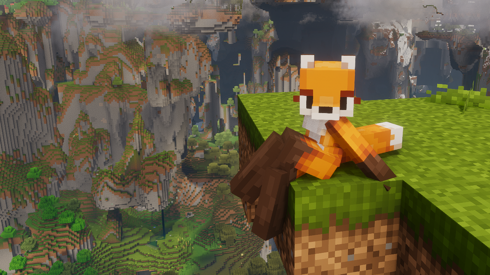
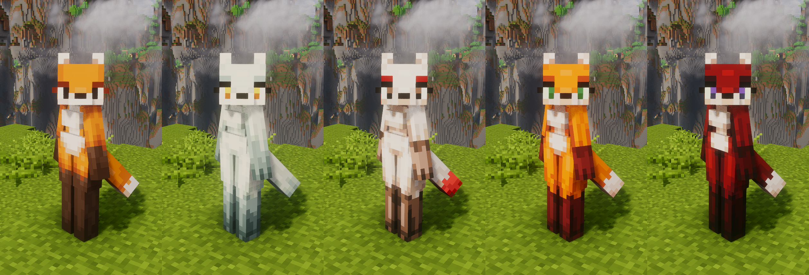

# Vixen

> A pack of... foxes?

A playable [Figura](https://github.com/FiguraMC/Figura) avatar for Minecraft.

Watch the trailer [here](https://www.youtube.com/watch?v=imlNdjn5elc)!

> [!TIP]
> NEW! Custom skin guide. [Learn more.](#custom-skin-guide-very-simple)

> [!IMPORTANT]  
> These are merely client side visuals and do **not** include custom movement or world generation (as you might have seen it in older videos). There are plans about those too, read down below.

## Installation

- Download and install [Figura](https://modrinth.com/mod/figura)
- Download the avatar (big green `<> Code` button > Download ZIP, or [here](https://github.com/Gilgames32/vixen/archive/refs/heads/master.zip))
- Unzip the contents of the file and put the `vixen-master` folder into the `.minecraft/figura/avatars/` folder
- You can select the avatar by clicking the Figura icon in the pause menu, then selecting Vixen 

## Recommend extras

> Mods, resourcepacks and shaders to enhance the experience.

These are also just for visuals, no movement changes, all client side.

Mods:

- [Leawind's Third Person](https://modrinth.com/mod/leawind-third-person) (better third person camera)
- [Moderner Beta](https://modrinth.com/mod/moderner-beta/versions) (for beta worldgen)

Resourcepacks:

- [Stay True](https://www.curseforge.com/minecraft/texture-packs/stay-true) (more diverse foliage)
- [We Don't Bite](https://modrinth.com/resourcepack/wedontbite) (fox villagers :3, requires [EMF](https://modrinth.com/mod/entity-model-features) and [ETF](https://modrinth.com/mod/entitytexturefeatures))

Shaders:

- coming soon

## Features

> [!NOTE]
> To use the action wheel, hold `B`, click to select and right click to go back.

- Tail physics (real)!
- Custom animations! Too many to list. Watch the trailers!
  - There are some extra animations you can play manually from the action wheel, moving stops the animation.
  - Closed eyes during sleep.
- Hold certain items in the mouth. Tools will also be held in the mouth while spriting. You can modify which items and tools are held in the mouth in `scrips/items.lua`.
- Hold `H` to wag the tail. Also moves the ears a little :3c
- 5 different skins. Can be changed manually from the action wheel.
- Option to [add your own skin](#custom-skin-guide-very-simple).

- Adaptive skin depending on the biome and dimension. Can be enabled from the action wheel.
- Replaces some player sounds with the vanilla fox sound effects.
- Soundboard for the vanilla fox sound effects. Can be played from the action wheel.
  - Snores while sleeping.

### Custom skin guide (very simple)

- In the `assets/` folder edit `skin_custom.png` and `skin_custom_sleep.png` according to your liking.
  - You can use Blockbench for painting in 3D or any other image editor.
  - If you are using a newer version of Blockbench do **NOT** save the model, only the texture. Newer versions of Blockbench aren't compatible with Figura.
  - You only need to paint the head of the sleeping version, the rest will be ignored. The templates should be of help.
  
- In the `scripts/` folder edit the `skins.lua` script.
  - Remove the lines starting with `--[[` and `--]]` to enable the custom skin entry.
  - Customize it to your liking. The comments should be of help.
  - To make it the default skin set `currentSkin` to `skinEntries.Custom`

## Credits

Thanks to Rohan for the original idea, model, some animations as well as for helping with the project. 
The textures of Mira, Rue, Eva and Kaya were originally made by Rohan and were touched up by Toucinin. 
Shoutout to GrandpaScout for GSAnimBlend, JimmyHelp for EZAnims, Auriafoxgirl for inspiration on the tail physics and to ChloeSpacedOut for her figura tutorials. 

# Plans

While the avatar is mostly done, there are some issues I would like to fix and extras I would like to add. You can see those [here](https://github.com/Gilgames32/vixen/issues).
Ideas are welcome too, but I might not add them.

While this project does not yet include the movement and the world generation seen in Rohan's old videos, there are plans to resurrect those parts too. 
Help would be appreciated.

## Contribution

There is my first time ever working with Figura, BlockBench and Lua. There could be bugs, sluggish animations and plenty of other issues.
Helpful issues and pull requests are welcome. Feel free to contact me if you are more interested in contributing to the avatar or to the rest of the project.
